**Table of Contents:**
  - [Overview](#overview)
  - [Target audience](#target-audience)
  - [Scope of this document](#scope-of-this-document)
  - [Installation and configuration](#installation-and-configuration)
    - [Prerequisites](#prerequisites)
    - [Test the latest docker image](#test-the-latest-docker-image)
    - [Install and configure ownCloud server](#install-and-configure-owncloud-server)
  - [User Management](#user-management)
    - [Allow access to users](#allow-access-to-users)
    - [Add a user account](#add-a-user-account)
  - [Connect to ownCloud server](#connect-to-owncloud-server)
    - [Desktop client](#desktop-client)
    - [Mobile client](#mobile-client)
      - [Android](#android)
      - [iOS](#ios)
  
 ___

# Overview
ownCloud is an open-source client–server software for content collaboration. Using ownCloud you can create, manage, store, and share data and documents in real-time, seamlessly and simultaneously, from any compatible device and location. You can efficiently access, edit, monitor, sync, and comment on documents within the team and outside, in an easy, [secure](https://owncloud.com/product/security/) and productive manner.

- Visit https://owncloud.com/features/ for a complete list of features and capabilities of ownCloud.
- Visit [official ownCloud channel](https://www.youtube.com/channel/UC_4gez4lsWqciH-otOlXo5w) and [ownClouders community channel](https://www.youtube.com/channel/UCA8Ehsdu3KaxSz5KOcCgHbw) on YouTube for tutorials.
- Visit [doc.owncloud.org](https://doc.owncloud.org/) and [doc.owncloud.com](https://doc.owncloud.com/) for current editions of ownCloud manuals.

---

# Target audience
This document is intended for users with the following roles and describes procedures to perform the following tasks related to  the community edition of ownCloud server:
- **Administrator**
  - Install and configure an ownCloud server.
  - Allow access to connect to the ownCloud server, using the server's IP address and port number 8080.
  - Add a user account.
- **User**
  - Connect to the ownCloud server using a desktop or mobile client.
  
---

# Scope of this document
- **For procedures related to Administrator role:** This document provides information and instructions with its scope limited only to a quick, easy, and basic setup of the community edition of ownCloud server on a single Ubuntu 18.04 LTS machine, using a Docker image.

  This document assumes that you have already met the following conditions:
  - [Deployment Recommendations](https://doc.owncloud.com/server/10.5/admin_manual/installation/deployment_recommendations.html) and [System Requirements](https://doc.owncloud.com/server/10.5/admin_manual/installation/system_requirements.html).
  - A 64-bit version of Ubuntu 18.04 LTS operating system is installed with a Docker Engine and a Docker Compose CLI tool, on your local machine.

> **Note:** This document does not cover the steps necessary for a detailed [manual installation](https://doc.owncloud.org/server/10.5/admin_manual/installation/manual_installation.html). If you are an experienced administrator who prefers a detailed manual installation and configuration, refer to the ownCloud's detailed [Admin Manual](https://doc.owncloud.org/server/10.5/admin_manual/installation/).
  
- **For procedures related to User role:** This document provides information and instructions with its scope limited only to quickly access the ownCloud server using a desktop client (Mac OS X and Windows) or mobile client (Android and iOS).

  - **For Mac OS X and Windows:** This document provides procedural information to install and configure a desktop client using **_only_** the [Installation Wizard](https://doc.owncloud.com/desktop/installing.html#installation-wizard).
  
  > **Note:** This document does not cover desktop client installation instructions specific to _Linux distribution_.

---

# Installation and configuration
You can install ownCloud using Docker and the official [ownCloud Docker image](https://hub.docker.com). This topic provides the following information for the minimal installation and basic configuration of the ownCloud server:
 - [Prerequisites](#prerequisites)
 - [Test the latest docker image](#test-the-latest-docker-image)
 - [Install and configure ownCloud server](#install-and-configure-owncloud-server)

## Prerequisites
1. Open the terminal, and execute the `lsb_release -a` command to verify that your Operating System version is [Ubuntu 18.04 LTS](https://releases.ubuntu.com/18.04/).

   You should see an output similar to this:
   ```bash
   $ lsb_release -a

   No LSB modules are available.
   Distributor ID: Ubuntu
   Description:    Ubuntu 18.04.3 LTS
   Release:        18.04
   Codename:       bionic
   ```
   >**Note:** The current official Docker image for ownCloud server is compatible only with Ubuntu 18.04.
   
2. Execute the `docker` command to verify that the docker is installed and running.

   You should see an output similar to this:
   ```bash
   $ docker

   Usage:	docker [OPTIONS] COMMAND

   A self-sufficient runtime for containers

   Options:
      --config string      Location of client config files (default "/home/srivaralakshmi/.docker")
      -c, --context string     Name of the context to use to connect to the daemon (overrides DOCKER_HOST env var and default context set with "docker context use")
      -D, --debug              Enable debug mode
      -H, --host list          Daemon socket(s) to connect to
      -l, --log-level string   Set the logging level ("debug"|"info"|"warn"|"error"|"fatal") (default "info")
          --tls                Use TLS; implied by --tlsverify
          --tlscacert string   Trust certs signed only by this CA (default "/home/srivaralakshmi/.docker/ca.pem")
          --tlscert string     Path to TLS certificate file (default "/home/srivaralakshmi/.docker/cert.pem")
          --tlskey string      Path to TLS key file (default "/home/srivaralakshmi/.docker/key.pem")
          --tlsverify          Use TLS and verify the remote
      -v, --version            Print version information and quit

    Management Commands:
    builder     Manage builds
    config      Manage Docker configs
    container   Manage containers
    context     Manage contexts
    engine      Manage the docker engine
    image       Manage images
    network     Manage networks
    node        Manage Swarm nodes
    ...
    ...
    ...
    ```


Visit [official docker documentation](https://docs.docker.com/engine/install/ubuntu/) for more information on the Docker Engine and its installation.

## Test the latest docker image
1. Download the [official docker image](https://hub.docker.com/r/owncloud/server/tags) for ownCloud server 10.5, by executing the following command:

   ```bash
   $ docker pull owncloud/server:10.5
   ```
   On successful download of newer image, the following status message is displayed:

   ```bash
   Status: Downloaded newer image for owncloud/server:10.5docker.io/owncloud/server:10.5
   ```
   >**Note:** The time taken to download the image from Docker Hub may vary depending on your connection speed.
   
2. (Optional) If you are denied permission to connect to the Docker daemon socket and get the following error message, execute the `sudo chmod 666 /var/run/docker .sock` command, enter your password on prompt, and retry downloading the docker image again:
   
   ```bash
   Got permission denied while trying to connect to the Docker daemon socket at unix:///var/run/docker.sock: Get http://%2Fvar%2Frun%2Fdocker.sock/v1.39/containers/json: dial unix /var/run/docker.sock: connect: permission denied
   ```
   
3. Run the downloaded official docker image on port `8080` by executing the following command:
  
    ```bash
    $ docker run -p8080:8080 owncloud/server:10.5
    ```
   Wait until you see the following output:
   
    ```bash
    Starting apache daemon...
    ```
   
4. Enter `http://localhost:8080` in the address bar of your favorite browser. 
   Alternatively, you can enter `http://<public-IP-address>:8080`, the public IP address of the machine, if you have one.
   
   >**Tip:** Although the containers are up and running, it may still take a few minutes until onwCloud is fully functional. If you do not see the web page, check the logs displayed on the terminal. If you are using a remote server, try SSH tunneling.

   The login page of the ownCloud web user interface (UI) is displayed.
   
   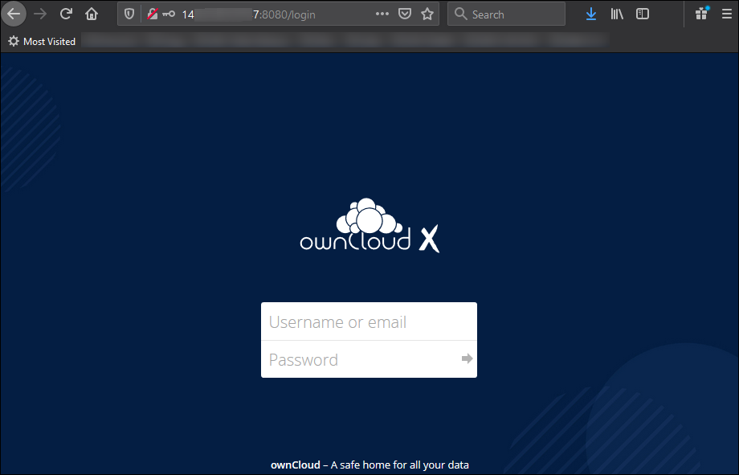
   
   >**Note:** You do not have any valid user credentials, yet. As a result, you cannot use the docker image to log in to the ownCloud server.
   
5. Execute the following commands in the terminal to stop the container and remove it from your machine:

   ```bash
   $ docker ps -a
   CONTAINER ID        IMAGE                  COMMAND                  CREATED             STATUS              PORTS                    NAMES
   11f315a007b3        owncloud/server:10.5   "/usr/bin/entrypoint…"   29 minutes ago      Up 29 minutes       0.0.0.0:8080->8080/tcp   quirky_germain
    
   $ docker stop quirky_germain
   quirky_germain

   $ docker ps -a
   CONTAINER ID        IMAGE                  COMMAND                  CREATED             STATUS                        PORTS               NAMES
   11f315a007b3        owncloud/server:10.5   "/usr/bin/entrypoint…"   32 minutes ago      Exited (137) 51 seconds ago                       quirky_germain

   $ docker rm quirky_germain
   quirky_germain

   $ docker ps -a
   CONTAINER ID        IMAGE               COMMAND             CREATED             STATUS              PORTS               NAMES

   ```
   
The testing of the latest official ownCloud Docker image is successful.
   
## Install and configure ownCloud server
1. Execute the following commands to create a project directory with the name `owncloud-docker-server` in your terminal and navigate to it:

    ```bash
    $ mkdir owncloud-docker-server
    $ cd owncloud-docker-server
    ```
    
2. Execute the following command to download the `docker-compose.yml` file from the GitHub repository of ownCLoud into your directory:

    ```bash
    $ wget https://raw.githubusercontent.com/owncloud/docs/master/modules/admin_manual/examples/installation/docker/docker-compose.yml
    ```
   You should see an output similar to this:
   
    ```bash
    --2020-11-29 17:04:30--  https://raw.githubusercontent.com/owncloud/docs/master/modules/admin_manual/examples/installation/docker/docker-compose.yml
    Resolving raw.githubusercontent.com (raw.githubusercontent.com)... 151.101.112.133
    Connecting to raw.githubusercontent.com (raw.githubusercontent.com)|151.101.112.133|:443... connected.
    HTTP request sent, awaiting response... 200 OK
    Length: 1650 (1.6K) [text/plain]
    Saving to: ‘docker-compose.yml’

    docker-compose.yml  100%[==================>]   1.61K  --.-KB/s    in 0s      

    2020-11-29 17:04:31 (9.21 MB/s) - ‘docker-compose.yml’ saved [1650/1650]
    ```
    You can notice that the `docker-compose.yml` file is now downloaded and saved in the `owncloud-docker-server` project directory.

3. Create a `.env` file using your favorite text editor and copy the following environment configuration settings in it:

    ```bash
    OWNCLOUD_VERSION=10.5
    OWNCLOUD_DOMAIN=localhost
    ADMIN_USERNAME=admin
    ADMIN_PASSWORD=admin
    HTTP_PORT=8080
    ```
    
4. Save the `.env` file in the `owncloud-docker-server` project directory.

5. Execute the `ls -a` command to verify that the `.env` file is now listed along with the docker-compose.yml file in the `owncloud-docker-server` project directory.

    ```bash
    ~/ownCloud-docker-server$ ls -a
    .  ..  docker-compose.yml  .env
    ```
    
6. Execute the `docker-compose up -d` command to build and start the container, using the `docker-compose` CLI tool.

    ```bash
    $ docker-compose up -d
    
    Creating network "ownclouddockerserver_default" with the default driver
    Creating volume "ownclouddockerserver_files" with local driver
    Creating volume "ownclouddockerserver_redis" with local driver
    Creating volume "ownclouddockerserver_backup" with local driver
    Creating volume "ownclouddockerserver_mysql" with local driver
    Pulling redis (webhippie/redis:latest)...
    latest: Pulling from webhippie/redis
    ae4a0e1e8235: Pull complete
    1e24c34b24d1: Pull complete
    95f9aef2e99d: Pull complete
    9641411ccde6: Pull complete
    3c5b5eddcd67: Pull complete
    Digest: sha256:42f6d51be6a7a5ef6fb672e98507824816566f0b1f89c19b2d585f54e26b2529
    Status: Downloaded newer image for webhippie/redis:latest
    Pulling db (webhippie/mariadb:latest)...
    latest: Pulling from webhippie/mariadb
    ae4a0e1e8235: Already exists
    1e24c34b24d1: Already exists
    95f9aef2e99d: Already exists
    bd3d546db57d: Pull complete
    ce65dc9183aa: Pull complete
    Digest: sha256:8a2c927529e5fd6238f08f79e3855d90a353e4475481574aa4bf0b90550b5db9
    Status: Downloaded newer image for webhippie/mariadb:latest
    Creating ownclouddockerserver_redis_1 ...
    Creating ownclouddockerserver_db_1 ...
    Creating ownclouddockerserver_redis_1
    Creating ownclouddockerserver_redis_1 ... done
    Creating ownclouddockerserver_owncloud_1 ...
    Creating ownclouddockerserver_owncloud_1 ... done
    ```
    
7. Execute the `docker-compose ps` command to verify whether all the containers have successfully started.

    ```bash
    $ docker-compose ps
             Name                            Command               State           Ports
     -------------------------------------------------------------------------------------------------
    ownclouddockerserver_db_1         /usr/bin/entrypoint /bin/s ...   Up      3306/tcp
    ownclouddockerserver_owncloud_1   /usr/bin/entrypoint /usr/b ...   Up      0.0.0.0:8080->8080/tcp
    ownclouddockerserver_redis_1      /usr/bin/entrypoint /bin/s ...   Up      6379/tcp
    ```
    
    You have successfully verified that the server is up and running.
    
8. (Optional) Execute the `docker-compose stop` command to stop the server.

The installation and basic configuration of the ownCloud server is complete.

Refer to [Installing with Docker](https://doc.owncloud.org/server/10.5/admin_manual/installation/docker/) for a complete information on managing a docker-based deployment.

>**Note:** The following procedures assume that as a prerequisite, you have the ownCloud server up and running with the default environment values.


---

# User Management
This topic provides procedural information for an administrator to perform the following user management tasks:
  - [Allow access to users](#allow-access-to-users) to connect to the ownCloud server, using the server IP address and port number 8080
  - [Add a user account](#add-a-user-account)

## Allow access to users
>**Note:** This procedure and its process may vary depending on your network and firewall settings, and whether the server host is an actual machine or a virtual one.

1. Enter `http://localhost:8080` in the address bar of your browser. 
   Alternatively, you can enter `http://<public-IP-address>:8080`, the public IP address of the machine, if you have one.
   
   The login page is displayed.
   
   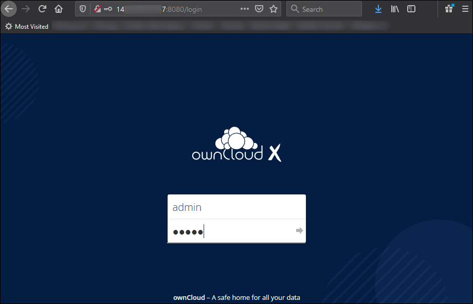
   
2. Enter your admin account credentials (default: `admin`/`admin`), which you configured in the `.env` file earlier.

   You are now logged in as an administrator.
   
   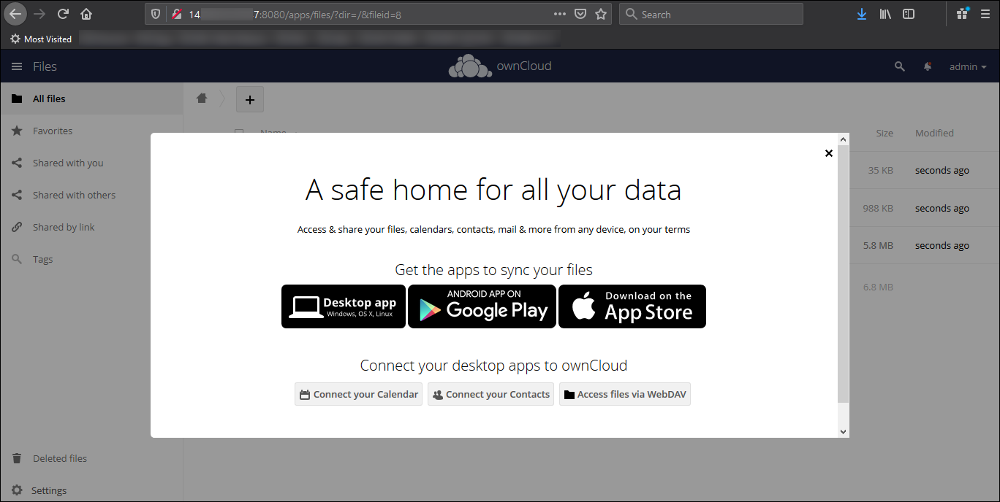
   
3. Close the prompt related to the installation of desktop and mobile clients.

   The **Files** page of the ownCloud web UI is displayed.

   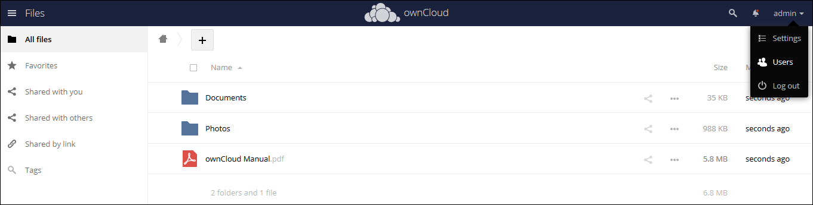

4. Note down the public IP address of the server.
   
   >**Tip:** If policies permit, you can try port forwarding to expose the server over the internet.
   
5. [Add users](#add-a-user-account), and share the public IP address and the port (default: `8080`) of the server.

>**Important:** For ownCloud clients (both desktop and mobile): Ensure to configure and enable the [OAuth 2](https://doc.owncloud.com/server/10.5/admin_manual/configuration/server/security/oauth2.html) application for the server.

Visit [ownCloud marketplace for OAuth2](https://marketplace.owncloud.com/apps/oauth2) for  a complete information on OAuth2 application.

## Add a user account
>**Tip:** See [User Account Properties](#user-account-properties), for a list of properties associated with a user account.

1. Log in to the ownCloud server as an administrator.
  
   >**Tip:** Refer to [Reset Admin Password](https://doc.owncloud.com/server/admin_manual/configuration/user/reset_admin_password.html), in case you have lost or forgotten your credentials.
  
   The **Files** page is displayed.
  
2. Expand the drop-down located at the top-right corner (default: `admin`) and click **Users**.
   
   The **Users** page is displayed.
   
   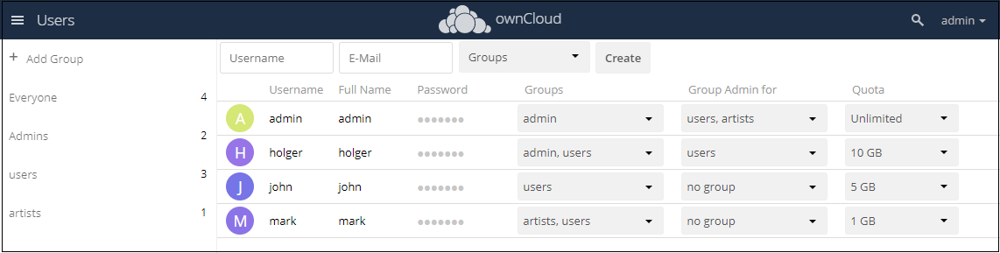
   
   >**Note:** By default, the drop-down shows admin at the top of the list.
   
3. Enter the **Username** (Login Name) and **E-Mail** of the new user.

4. (Optional) Assign the user a membership to the available **Groups**.

    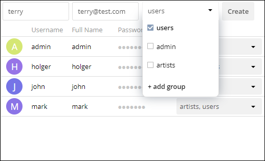

5. Click **Create**.

User account is created successfully, and the details of the user are now visible in the **Users** page.

>**Note:** The user receives an e-mail containing the username and a system-generated password. You cannot recover the password of a user but can reset it. If you have encryption enabled, there are special considerations for user password resets. For more information, see [Encryption Configuration](https://doc.owncloud.com/server/10.5/admin_manual/configuration/files/encryption/encryption_configuration.html).

#### User Account Properties

| Property | Description |    
| --- | --- |    
| **Username (Login Name)** | (**Mandatory**) The unique ID of an ownCloud user. It may contain letters (`a-z`, `A-Z`), numbers (`0-9`), dashes (`-`), underscores (`_`), periods (`.`) and at signs (`@`). Once set, you cannot change the **Username**. |    
| **E-Mail** | (**Mandatory**) The e-mail address of the user, set by the administrator. |    
| **Groups** | (**Optional**) By default, new users are not assigned any groups. However, you can create groups and assign users to groups, based on their roles and policies, and account privileges. |    
| **Full Name** | (**Optional**) The display name of the user. If not set, it defaults to the login name. The full name appears on file shares, the ownCloud Web interface, and emails. |    
| **Password** | (**Mandatory**) The password associated with the account of the user. It can be changed by administrators and users. |    
| **Group Admin** | (**Optional**) Administrators of specific groups. They have the privileges to add, delete, and modify members of their respective group. As an administrator, you can designate one or more members of a group as group administrators. |    
| **Quota** | (**Mandatory**) The maximum disk space allocated to each user for uploading and syncing files. As an administrator, you have the option to provision [external storage](https://doc.owncloud.com/server/admin_manual/configuration/files/external_storage/) in user quotas. | 

Refer to [User Management](https://doc.owncloud.com/server/admin_manual/configuration/user/user_configuration.html) for other common tasks such as renaming a user, resetting password, deleting a user, and managing groups.

---

# Connect to ownCloud server
This topic provides procedural information on how you can access the ownCloud server to sync and share your files and folders using the following clients:

  - [Desktop client](#desktop-client)
  - [Mobile client](#mobile-client)
      - [Android](#android)
      - [iOS](#ios)

## Desktop client
ownCloud Desktop Sync Client is available for Mac OS X, Windows, and various Linux distributions. ownCloud Desktop Sync Client enables you to access the ownCloud server, integrate your ownCloud into your file manager, and have the latest files and data automatically synchronized between your ownCloud server and local system, wherever they are located.

1. Download the latest version of the [ownCloud desktop client application](https://owncloud.com/desktop-app/) that is suitable for your desktop operating system.

2. Double-click the downloaded program file to launch the installation.
   
   The **ownCloud Connection Wizard** screen is displayed.
   
3. Enter the URL of your ownCloud server in the Server Address field and click **Next**.

   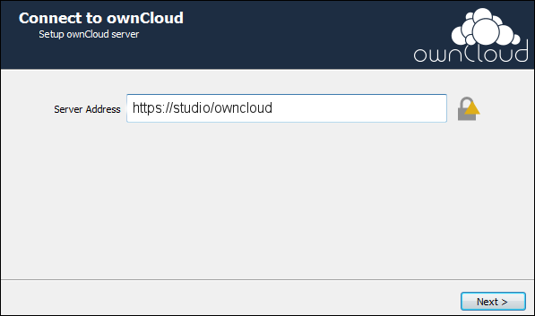
   
4. Enter the user credentials of your ownCloud server to log in and click **Next**.

   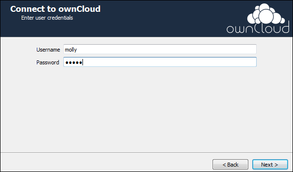
   
5. Perform the following tasks to set up the local folder options:
   
   i. For **Server**: Select one of the following two options:
      - Sync everything from server
      - Choose what to sync
      
   ii. For **Local Folder**: Choose your local sync folder
   
   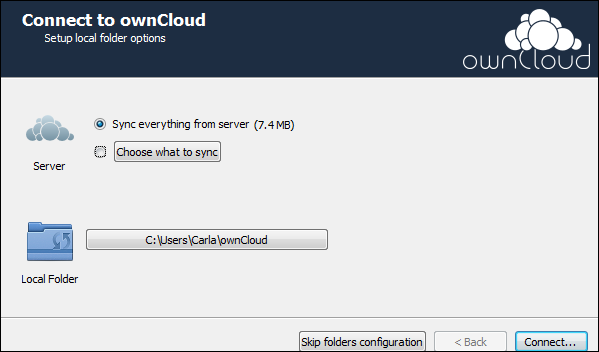
      
   >**Note:** The default local sync folder is **_ownCloud_**, in your home directory.
   
6. Click **Connect**.

   The desktop client application attempts to connect you to the ownCloud server.

   >**Note:** If you are successfully connected to your ownCloud server, you are prompted with two options to prefer how you want to [synchronize](https://doc.owncloud.com/desktop/navigating.html) your files and folder with the ownCloud server.

7. Select one of the following two options:
   - Open ownCloud in Browser
   - Open Local Folder
   
    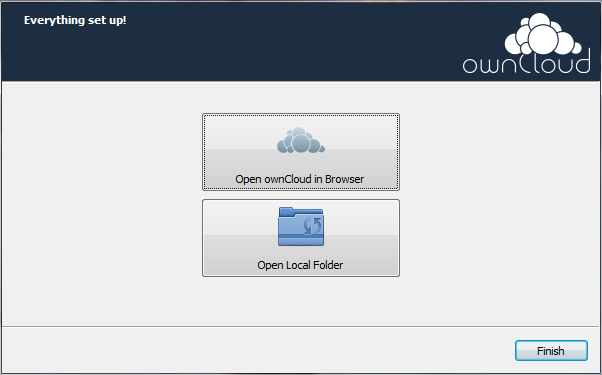
    
8. Click **Finish**.
   
   The ownCloud server starts synchronizing your files and folders with the ownCloud server.
   
Refer to [ownCloud - Desktop](https://doc.owncloud.com/desktop/) for more information on installation, configuration, and usage of the desktop client.

## Mobile client
The ownCloud mobile client is available for mobile devices with an Android or iOS operating system. The ownCloud mobile client helps you to quickly connect to the ownCloud server from your mobile devices, automatically synchronize files, share files, upload photos and videos, and add files from your mobile device to the ownCloud server.

### Android
With ownCloud Android App you can browse all your ownCloud synced files, create and edit new files, share these files and folders with co-workers, and keep the contents of those folders in sync across all your devices. 

1. Download the [ownCloud Android](https://owncloud.com/mobile-apps/) application.

   >**Note:** Alternatively, you can log in to the [ownCloud web interface](https://doc.owncloud.com/server/10.5/user_manual/webinterface.html) and download ownCloud Android App from your **Personal** page by clicking on the link to the application.

2. Install ownCloud Android App.

   >**Note:** The installation is very similar to all other mobile applications. When you run ownCloud Android App for the first time, the **New Features Wizard** screen is displayed. This wizard provides you a quick overview of the new features in the application so that you can easily use them at the earliest.
   
   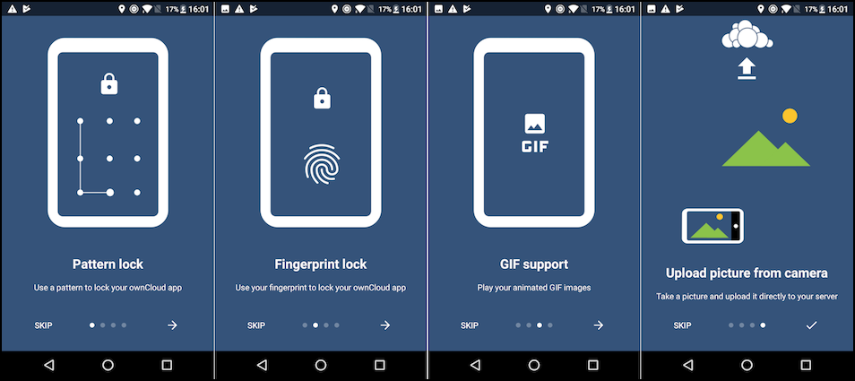
   
3. Enter the URL of your ownCloud server and your login credentials (username and password) to log in to the application.

   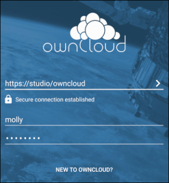

4. Click **Yes**, if you see a prompt about trusting the certificates of the server.

   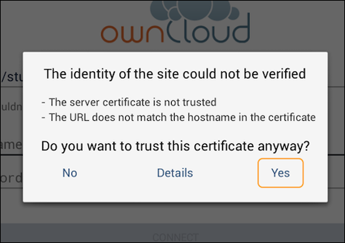

5. Use ownCloud Android App, starting at the **All Files** screen.

   

Refer to [ownCloud - Android documentation](https://doc.owncloud.com/android/) for a complete information on the setup and usage of ownCloud Android App.

### iOS
ownCloud iOS App enables you to access, work off-line and online, upload, and share files and folders safely and comfortably from your iPhone and iPad.

1. Download the [ownCloud iOS](https://owncloud.com/mobile-apps/) application.

   >**Note:** Alternatively, you can log in to the [ownCloud web interface](https://doc.owncloud.com/server/10.5/user_manual/webinterface.html) and download ownCloud iOS App from your **Personal** page by clicking on the link to the application.

2. Install ownCloud iOS App.

   >**Note:** The installation is very similar to all other mobile applications.
   
3. Enter the URL of your ownCloud server and your login credentials (username and password) to log in to the application.

   

4. Click **Yes**, if you see a prompt about trusting the certificates of the server.

   

5. Use ownCloud iOS App, starting at the **Files** screen.

   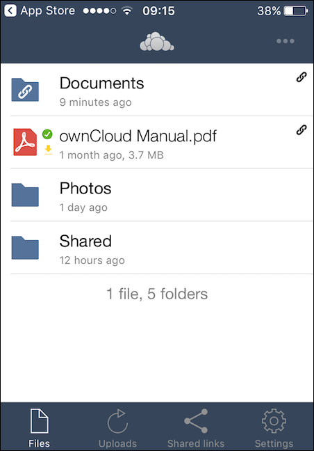
   
Refer to [ownCloud - iOS documentation](https://doc.owncloud.com/ios-app/) for a complete information on the setup and usage of ownCloud iOS App.
